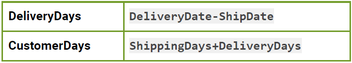

Desafío - Transformación y manipulación de datos (Parte II)

En este desafío validaremos nuestros conocimientos relacionados con los diferentes tipos
de datos que almacenamos en DataFrames, y la manipulación de elementos en ellos. Para
lograrlo, necesitarás aplicar lo que has aprendido durante esa sesión.

Lee todo el documento antes de comenzar el desarrollo individual, para asegurarte de tener
el máximo de puntaje y enfocar bien los esfuerzos.

Descripción

La empresa ADL se dedica a la venta de productos a nivel regional en los Estados Unidos,
con equipos de ventas que operan en diferentes estados. La compañía ha establecido un
sistema de comisiones para incentivar a sus equipos de ventas a preferir la venta de
productos de alto margen antes que los de bajo margen de utilidad.

Como Analista de Datos, le solicitan analizar información sobre las ventas realizadas por
los equipos de ventas de ADL, incluyendo detalles sobre los productos vendidos, los
clientes, las fechas de los pedidos y los plazos de entrega.

Para resolver este desafío deberás cargar datos desde Hojas de Excel del archivo
US_Regional_Sales_Data.xlsx. En base a esto, debe generar una visualización de datos
como la que se muestra en las hojas Reporte1 y Reporte2 del archivo reporte.xlsx.

Para cumplir con lo solicitado, puedes aplicar los siguientes pasos:
- 1. Carga los datos de cada pestaña del archivo US_Regional_Sales_Data.xlsx en un
DataFrame independiente. (hint: Puedes obtener los nombres de las hojas usando
pd.ExcelFile(archivo).sheet_names)
- 2. Cruza todos los DataFrames usando validación many_to_one, y guarda el resultado
en una nueva variable llamada df_base.
- 3. Agrega las siguientes columnas a df_ base:

hint: Asegúrate de que las columnas sean de tipo datetime.

- 4. Agrega una nueva columna discreta al df_base, con el nombre CustomerDaysInterval
que clasifique los valores de la columna CustomerDays en los siguientes intervalos:
○ 0 to 15 days
○ 15 to 30 days
○ 30 to 45 days
○ 45 to 60 days
○ 60 to 75 days
○ 75 to 90 days
hint: Utiliza pd.cut con estas etiquetas de Intervalo. Puedes convertir previamente
la columna CustomerDays a valores numéricos con pd.to_numeric(). Considera que
en este caso, el resultado es entregado en formato 10**9 segundos, por lo que
debes dividir el resultado por este valor
- 5. Utiliza una tabla pivote para mostrar el conteo de órdenes agrupando por Sales
Team en las filas y CustomerDaysInterval en las columnas. Este reporte debe
cuadrar con los datos de la pestaña Reporte1 del archivo reportes.xlsx
- 6. Agrega la siguiente columna calculada a la base:

Visión de Negocio: El margen bruto es un indicador financiero que muestra la diferencia entre
los ingresos generados por la venta de un producto o servicio y los costos directos asociados
con su producción o adquisición.
- 7. En esta parte debes aplicar un porcentaje a la columna GrossMargin, pero ese
porcentaje dependerá del intervalo en que se encuentre GrossMargin.

hint: Utiliza pd.cut con labels numéricas para que la columna resultante sea de tipo float.
- 8. Calcula el monto de la comisión, utilizando la Tabla del Anexo.

- 9. Calcula la comisión sobre el margen bruto.

- 10. Utilizando una tabla pivote, muestra la suma de los valores GrossMargin, NetMargin y
CommissionAmount agrupando por Sales Team en las filas. Este reporte debe cuadrar con
los datos de la pestaña Reporte2 del archivo reportes.xlsx

Anexo
Tabla de comisiones

